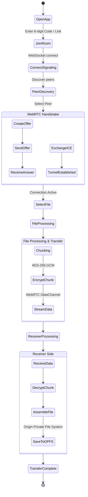

# Activity Diagram

This diagram displays the workflow sequence of an entire user session on Lynkless, from joining a room to completing a file transfer.

```mermaid
stateDiagram-v2
    [*] --> OpenApp
    OpenApp --> JoinRoom : Enter 6-digit Code / Link
    JoinRoom --> ConnectSignaling : WebSocket connect
    ConnectSignaling --> PeerDiscovery : Discover peers
    
    state "WebRTC Handshake" as Handshake {
        CreateOffer --> SendOffer
        SendOffer --> ReceiveAnswer
        ExchangeICE --> TunnelEstablished
    }
    
    PeerDiscovery --> Handshake : Select Peer
    Handshake --> SelectFile : Connection Active
    
    SelectFile --> FileProcessing
    state "File Processing & Transfer" as Processing {
        Chunking --> EncryptChunk : AES-256-GCM
        EncryptChunk --> StreamData : WebRTC DataChannel
    }
    
    FileProcessing --> Processing
    Processing --> ReceiverProcessing
    
    state "Receiver Side" as Receiving {
        ReceiveData --> DecryptChunk
        DecryptChunk --> AssembleFile
        AssembleFile --> SaveToOPFS : Origin Private File System
    }
    
    ReceiverProcessing --> Receiving
    Receiving --> TransferComplete
    TransferComplete --> [*]
```
