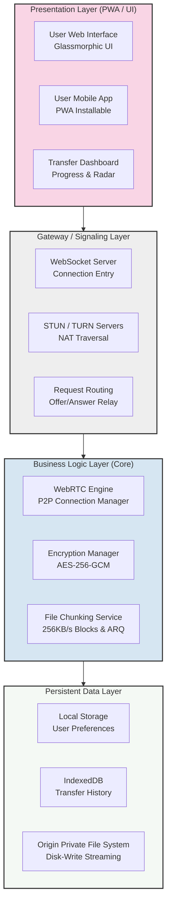

# Architecture Diagram

This diagram visualizes the multi-layered system architecture of Lynkless, separating presentation, gateway, business logic, and persistent data layers.

```mermaid
flowchart TD
    subgraph Presentation_Layer["Presentation Layer (PWA / UI)"]
        UI[User Web Interface<br>Glassmorphic UI]
        Mobile[User Mobile App<br>PWA Installable]
        Dashboard[Transfer Dashboard<br>Progress & Radar]
    end

    subgraph Gateway_Layer["Gateway / Signaling Layer"]
        WS[WebSocket Server<br>Connection Entry]
        STUN[STUN / TURN Servers<br>NAT Traversal]
        Router[Request Routing<br>Offer/Answer Relay]
    end

    subgraph Logic_Layer["Business Logic Layer (Core)"]
        RTC[WebRTC Engine<br>P2P Connection Manager]
        E2EE[Encryption Manager<br>AES-256-GCM]
        Chunker[File Chunking Service<br>256KB/s Blocks & ARQ]
    end

    subgraph Data_Layer["Persistent Data Layer"]
        LocalUser[Local Storage<br>User Preferences]
        IndexedDB[IndexedDB<br>Transfer History]
        OPFS[Origin Private File System<br>Disk-Write Streaming]
    end

    Presentation_Layer --> Gateway_Layer
    Gateway_Layer --> Logic_Layer
    Logic_Layer --> Data_Layer
    
    %% Styles
    classDef pres fill:#f9d5e5,stroke:#333,stroke-width:2px;
    classDef gate fill:#eeeeee,stroke:#333,stroke-width:2px;
    classDef logic fill:#d6e6f2,stroke:#333,stroke-width:2px;
    classDef data fill:#f4f9f4,stroke:#333,stroke-width:2px;
    
    class Presentation_Layer pres
    class Gateway_Layer gate
    class Logic_Layer logic
    class Data_Layer data
```
