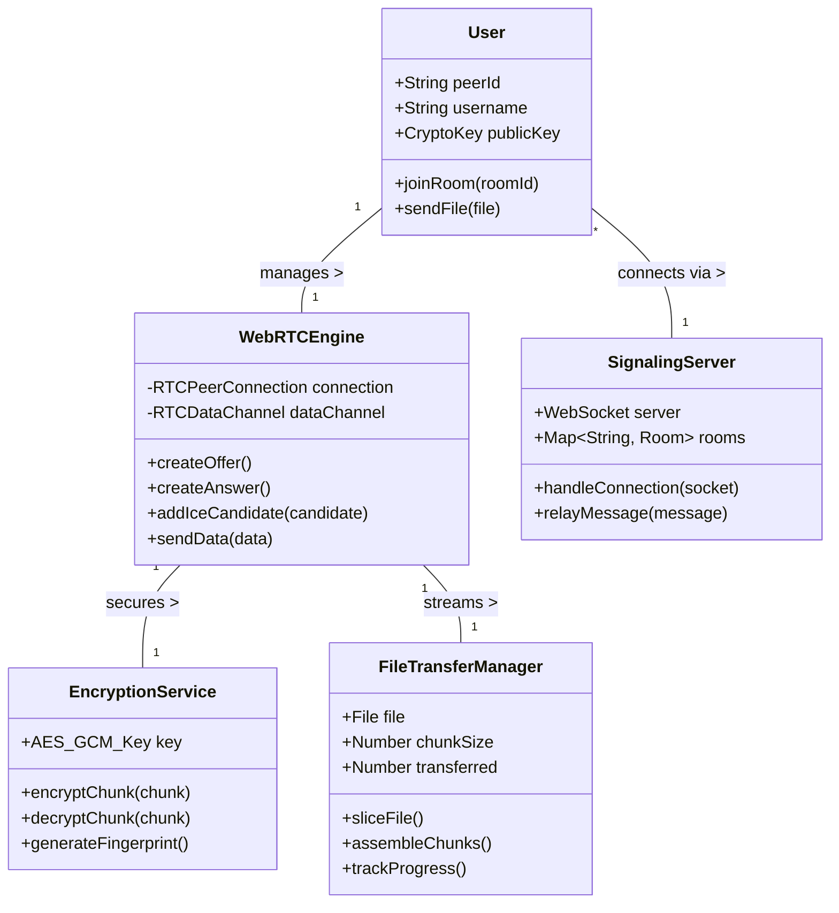

# Class Diagram

This diagram represents the object-oriented structure of the Lynkless system, including the major classes and their relationships.

```mermaid
classDiagram
    class User {
        +String peerId
        +String username
        +CryptoKey publicKey
        +joinRoom(roomId)
        +sendFile(file)
    }

    class WebRTCEngine {
        -RTCPeerConnection connection
        -RTCDataChannel dataChannel
        +createOffer()
        +createAnswer()
        +addIceCandidate(candidate)
        +sendData(data)
    }

    class SignalingServer {
        +WebSocket server
        +Map~String, Room~ rooms
        +handleConnection(socket)
        +relayMessage(message)
    }

    class FileTransferManager {
        +File file
        +Number chunkSize
        +Number transferred
        +sliceFile()
        +assembleChunks()
        +trackProgress()
    }

    class EncryptionService {
        +AES_GCM_Key key
        +encryptChunk(chunk)
        +decryptChunk(chunk)
        +generateFingerprint()
    }

    User "1" -- "1" WebRTCEngine : manages >
    WebRTCEngine "1" -- "1" EncryptionService : secures >
    WebRTCEngine "1" -- "1" FileTransferManager : streams >
    User "*" -- "1" SignalingServer : connects via >
```
