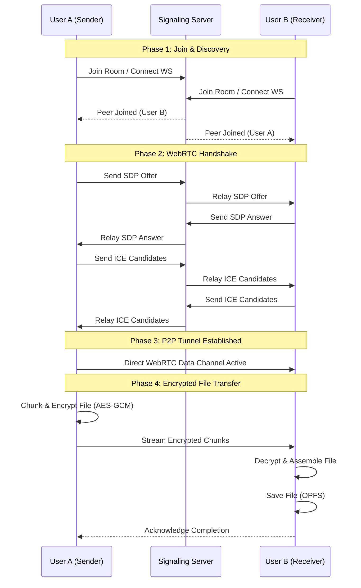

# Context Flow Diagram

This diagram demonstrates the sequence of interactions between a Sender, the Signaling Server, and a Receiver during a secure file transfer process.

```mermaid
sequenceDiagram
    participant Sender as User A (Sender)
    participant Signal as Signaling Server
    participant Receiver as User B (Receiver)

    Note over Sender,Receiver: Phase 1: Join & Discovery
    Sender->>Signal: Join Room / Connect WS
    Receiver->>Signal: Join Room / Connect WS
    Signal-->>Sender: Peer Joined (User B)
    Signal-->>Receiver: Peer Joined (User A)

    Note over Sender,Receiver: Phase 2: WebRTC Handshake
    Sender->>Signal: Send SDP Offer
    Signal->>Receiver: Relay SDP Offer
    Receiver->>Signal: Send SDP Answer
    Signal->>Sender: Relay SDP Answer
    Sender->>Signal: Send ICE Candidates
    Signal->>Receiver: Relay ICE Candidates
    Receiver->>Signal: Send ICE Candidates
    Signal->>Sender: Relay ICE Candidates

    Note over Sender,Receiver: Phase 3: P2P Tunnel Established
    Sender->>Receiver: Direct WebRTC Data Channel Active

    Note over Sender,Receiver: Phase 4: Encrypted File Transfer
    Sender->>Sender: Chunk & Encrypt File (AES-GCM)
    Sender->>Receiver: Stream Encrypted Chunks
    Receiver->>Receiver: Decrypt & Assemble File
    Receiver->>Receiver: Save File (OPFS)
    
    Receiver-->>Sender: Acknowledge Completion
```
