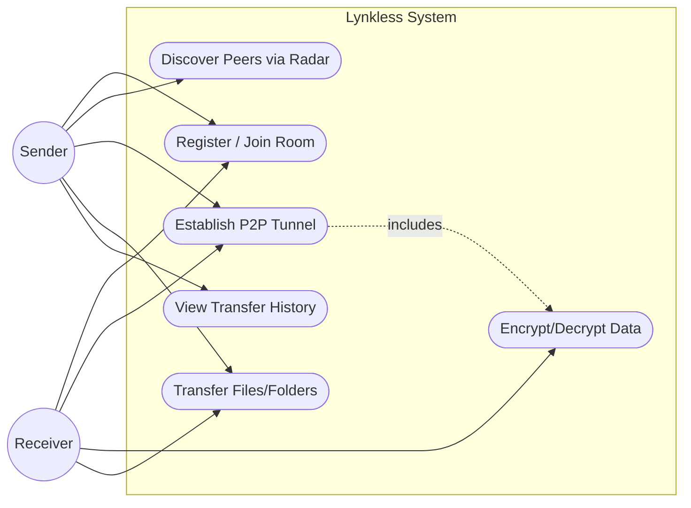

# Use Case Diagram

This diagram outlines the primary use cases and actors (Sender and Receiver) interacting with the Lynkless file transfer system.

```mermaid
flowchart LR
    subgraph Lynkless System
        UC1([Register / Join Room])
        UC2([Discover Peers via Radar])
        UC3([Establish P2P Tunnel])
        UC4([Encrypt/Decrypt Data])
        UC5([Transfer Files/Folders])
        UC6([View Transfer History])
    end

    User((Sender))
    Receiver((Receiver))

    User --> UC1
    User --> UC2
    User --> UC3
    User --> UC5
    User --> UC6

    Receiver --> UC1
    Receiver --> UC3
    Receiver --> UC4
    Receiver --> UC5

    UC3 ..->|includes| UC4
```
